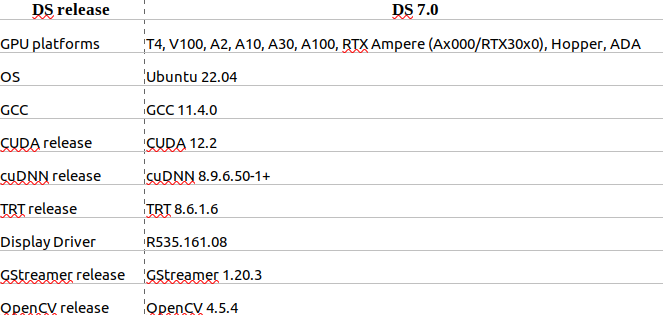

# DeepStream Setup and Deployment

- [DeepStream Setup and Deployment](#deepstream-setup-and-deployment)
  - [⚠️ Hardware and Software Requirements ⚠️](#️-hardware-and-software-requirements-️)
  - [⚙️ Setup ⚙️](#️-setup-️)
    - [1. ❇️ Nvidia Driver ❇️](#1-️-nvidia-driver-️)
    - [2. ❇️ Nvidia Cuda ❇️](#2-️-nvidia-cuda-️)
    - [3. ❇️ CuDNN ❇️](#3-️-cudnn-️)
    - [4. ❇️ TensorRT ❇️](#4-️-tensorrt-️)
    - [5. ❇️ DeepStream ❇️](#5-️-deepstream-️)
  - [2. ❇️ Download the Yolo-V4 `cfg` and `weights` files from Darknet repo to the DeepStream-Yolo folder ❇️](#2-️-download-the-yolo-v4-cfg-and-weights-files-from-darknet-repo-to-the-deepstream-yolo-folder-️)
  - [3. ❇️ Setup Yolo-V8 Convertor ❇️](#3-️-setup-yolo-v8-convertor-️)
  - [4. ❇️ Compile Code ❇️](#4-️-compile-code-️)
  - [5. ❇️ Copy Videos to Directory ❇️](#5-️-copy-videos-to-directory-️)
  - [6. ❇️ Run and Test Code ❇️](#6-️-run-and-test-code-️)
## ⚠️ Hardware and Software Requirements ⚠️
  

## ⚙️ Setup ⚙️

### 1. ❇️ Nvidia Driver ❇️

Download From : ⏬ **https://www.nvidia.com/en-us/drivers/**

Install Nvidia driver version 535.161.08 or above.

**Check installed Nvidia driver version by running the command:**

```
nvidia-smi
```

### 2. ❇️ Nvidia Cuda ❇️

⭕ Instructions : **https://docs.nvidia.com/cuda/archive/12.2.2/cuda-installation-guide-linux/index.html#ubuntu**

- #### ⭕ Method 1 ⭕
```
wget https://developer.download.nvidia.com/compute/cuda/repos/ubuntu2204/x86_64/cuda-ubuntu2204.pin
sudo mv cuda-ubuntu2204.pin /etc/apt/preferences.d/cuda-repository-pin-600
wget https://developer.download.nvidia.com/compute/cuda/12.2.0/local_installers/cuda-repo-ubuntu2204-12-2-local_12.2.0-535.54.03-1_amd64.deb
sudo dpkg -i cuda-repo-ubuntu2204-12-2-local_12.2.0-535.54.03-1_amd64.deb
sudo cp /var/cuda-repo-ubuntu2204-12-2-local/cuda-*-keyring.gpg /usr/share/keyrings/
sudo apt-get update
sudo apt-get -y install cuda

echo 'export PATH=/usr/local/cuda-12.2/bin:$PATH' >> ~/.bashrc
echo 'export LD_LIBRARY_PATH=/usr/local/cuda-12.2/lib64:$LD_LIBRARY_PATH' >> ~/.bashrc
source ~/.bashrc
```
  
- #### ⭕ Method 2 ⭕

```
wget https://developer.download.nvidia.com/compute/cuda/12.2.0/local_installers/cuda_12.2.0_535.54.03_linux.run
sudo sh cuda_12.2.0_535.54.03_linux.run

echo 'export PATH=/usr/local/cuda-12.2/bin:$PATH' >> ~/.bashrc
echo 'export LD_LIBRARY_PATH=/usr/local/cuda-12.2/lib64:$LD_LIBRARY_PATH' >> ~/.bashrc
source ~/.bashrc
```
**It is recommended to reboot the system after this step**

**Check installed Nvidia cuda version by running the command:**

```
nvcc --version
```

### 3. ❇️ CuDNN ❇️

⭕ Instructions : **https://docs.nvidia.com/deeplearning/cudnn/archives/cudnn-897/install-guide/index.html**

Download From : ⏬  **https://developer.nvidia.com/rdp/cudnn-archive** 

Download the file under :

cuDNN v8.9.7 (December 5th, 2023), for CUDA 12.x\
  |\
  |__Local Installer for Ubuntu22.04 x86_64 (Deb)  

```
sudo dpkg -i  cudnn-local-repo-ubuntu2204-8.9.7.29_1.0-1_amd64.deb
sudo cp /var/cudnn-local-repo-*/cudnn-*-keyring.gpg /usr/share/keyrings/
sudo apt-get update

sudo apt-get install libcudnn8=8.9.7.29-1+cuda12.2
sudo apt-get install libcudnn8-dev
```

**Check installed CuDNN version by running the command:**

```
grep CUDNN_MAJOR -A 2 /usr/include/cudnn_version.h
```

The expected output will be will below
```
#define CUDNN_MAJOR 8
#define CUDNN_MINOR 9
#define CUDNN_PATCHLEVEL 7
```

### 4. ❇️ TensorRT ❇️

⭕ Instructions : **https://docs.nvidia.com/deeplearning/tensorrt/latest/installing-tensorrt/installing.html**

Download From : ⏬ **https://developer.nvidia.com/nvidia-tensorrt-8x-download**

Download the file under :

TensorRT 8.6 GA\
|\
|__TensorRT 8.6 GA for x86_64 Architecture\
`       `|\
`       `|__TensorRT 8.6 GA for Ubuntu 22.04 and CUDA 12.0 and 12.1 DEB local repo Package

```
os="ubuntu2204"
tag="8.6.1-cuda-12.0"

sudo dpkg -i nv-tensorrt-local-repo-${os}-${tag}_1.0-1_amd64.deb
sudo cp /var/nv-tensorrt-local-repo-${os}-${tag}/*-keyring.gpg /usr/share/keyrings/
sudo apt-get update
sudo apt list tensorrt -a

version="8.6.1.6-1+cuda12.0"

sudo apt-get install libnvinfer-bin=${version} libnvinfer-dev=${version} libnvinfer-dispatch-dev=${version} libnvinfer-dispatch8=${version} libnvinfer-headers-dev=${version} libnvinfer-headers-plugin-dev=${version} libnvinfer-lean-dev=${version} libnvinfer-lean8=${version} libnvinfer-plugin-dev=${version} libnvinfer-plugin8=${version} libnvinfer-samples=${version} libnvinfer-vc-plugin-dev=${version} libnvinfer-vc-plugin8=${version} libnvinfer8=${version} libnvonnxparsers-dev=${version} libnvonnxparsers8=${version} python3-libnvinfer-dev=${version} python3-libnvinfer-dispatch=${version} python3-libnvinfer-lean=${version} python3-libnvinfer=${version} tensorrt-dev=${version} tensorrt-libs=${version} tensorrt=${version}

```

**Check installed TensorRT version by running the command:**

```
dpkg -l | grep nvinfer
```

The expected output will be will below
```
ii  libnvinfer-bin           8.6.1.6-1+cuda12.0          amd64   TensorRT binaries
...
...
...
```

### 5. ❇️ DeepStream ❇️

⭕ Instructions : **https://docs.nvidia.com/metropolis/deepstream/dev-guide/text/DS_Installation.html**

- ####  ❇️ Glib ❇️
  
```
pip3 install meson
pip3 install ninja

git clone https://github.com/GNOME/glib.git
cd glib
git checkout <glib-version-branch>
# e.g. 2.76.6
meson build --prefix=/usr
ninja -C build/
cd build/
ninja install
```

- ####  ❇️ GStreamer ❇️

```
sudo apt install libssl3 libssl-dev libgles2-mesa-dev libgstreamer1.0-0 gstreamer1.0-tools gstreamer1.0-plugins-good gstreamer1.0-plugins-bad gstreamer1.0plugins-ugly gstreamer1.0-libav libgstreamer-plugins-base1.0-dev libgstrtspserver-1.0-0 libjansson4 libyaml-cpp-dev libjsoncpp-dev protobufcompiler libgstreamer1.0-dev libx11-dev libjson-glib-dev libgbm1 libglapi-mesa gcc make git python3
```


- ####  ❇️ DeepStream ❇️

Download From : ⏬ **https://catalog.ngc.nvidia.com/orgs/nvidia/resources/deepstream/files?version=7.0**

Download the file : **deepstream-7.0_7.0.0-1_amd64.deb**

```
sudo apt-get install libnpp-12-2 libnpp-dev-12-2 libgstrtspserver-1.0-dev
sudo apt-get install ./deepstream-7.0_7.0.0-1_amd64.deb 
sudo apt-get install build-essential
```
**Check installed TensorRT version by running the command:**

```
deepstream-app --version
```

The expected output will be will below
```
deepstream-app version 7.0.0
DeepStreamSDK 7.0.0
```


## 2. ❇️ Download the Yolo-V4 `cfg` and `weights` files from [Darknet](https://github.com/AlexeyAB/darknet) repo to the DeepStream-Yolo folder ❇️

weights ⏬ :
```
wget https://github.com/AlexeyAB/darknet/releases/download/darknet_yolo_v3_optimal/yolov4.weights
```

cfg ⏬ :
```
wget https://github.com/AlexeyAB/darknet/releases/download/darknet_yolo_v3_optimal/yolov4.cfg
```

## 3. ❇️ Setup Yolo-V8 Convertor ❇️
Setup Yolo-V8 by following the instructions in [Yolo-V8](YOLOv8.md)

## 4. ❇️ Compile Code ❇️

```
make
```

## 5. ❇️ Copy Videos to Directory ❇️

⚠️⚠️   **This is a test script as of now without ROS integrated in it. So kindly keep the video names as front.mp4, rear.mp4, left.mp4, right.mp4, stereo-left.mp4, stereo-right.mp4 in the main directory**

## 6. ❇️ Run and Test Code ❇️

```
./deepstream-app -c configs/on-screen-display.txt
```

