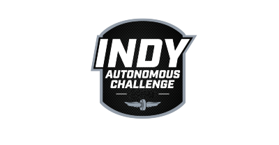

# INDY Autonomous Challenge Vision Models Scripts

## Version 2
Date : **16-03-2025**

Description : This repo contains code for:

1. Extracting frames from MCAP files
2. Randomly selecting **n** number of frames from the extracted frames.
3. Auto Annotating images to make annotation process faster.
4. Label Studio format convertor for importing into label studio.
5. Splitter for splitting final annotated data into Train/Test split.
6. Yolo training module.
7. Yolo model validation.

⭐ Models are kept in **Models** folder.

>❗❗**Note** : The code in this was tested and confirmed to be working on a system with the following specification:
> 
>- OS : Ubuntu 22.04.5 LTS  
>- GPU :NVIDIA GeForce RTX 3080, 16 GB  
>- Nvidia Driver Version : 550.127.05
>- Nvidia Cuda Version : 12.4  
>- Python : 3.10.12
