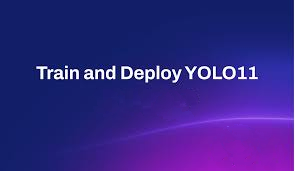
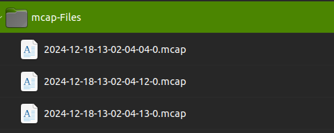
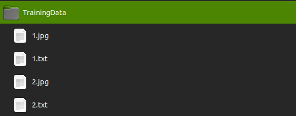

<p align="center">
  
</p>

# Steps to Fine Tune a YOLO V11 Model with Auto Annotaion to speed up the process.

## This folder contains various scripts for selecting images from dataset during training and validation.

```
❗❗The assumption here is that initially all the data is inside mcap files.
```


1. Keep your mcap files inside **mcap-Files** folder

    


2. Run **mcap-Frame-Extract.py** to extract all the frames from mcap files. The  extracted frames will be kept in **Frames** folder.


4. Run **image-Selector.py** to select pre-defined no of images from your data or modify it at ***line no 6*** .It'll save the selected images in **selectedImages** folder with random file names.

5. Go to **Auto-Annotate** folder, read the README there and set up everything as mentioned.

6. Go to **Label-Studio** folder, read the README there and set up everything as mentioned.

7. Once Label Studio Annotations are done and exported, move all the images in **selectedImages** folder and all the labels from label studio exported folder to the **TrainingData** folder in **Yolo-Trainer/TrainingData** . Make sure all jpeg/jpg and text files are there together like shown below:

    

8. Run **splitter.py** script to randomly split the training data into train and test with 80:20 split. The split data will be put into **dataset** directory.

9. In **./dataset/dataset.yaml**, give the full absolute path of **dataset** directory and modify other necessary info if required.

10. Modify **python3 train-yolo.py** as per our requirement and hardware and run the script to start training. The output model and metrics will be inside the **runs** folder.


11. To generate metrics for annotated validation data : 
    - Clear **/dataset/images/train/** folder and **/dataset/labels/train/**
    - Replace all the images in **/dataset/images/val/** and **/dataset/labels/val/** with the custom annotations.
    - Run the following command:
```
yolo val model=<model path>.pt data=./dataset/dataset.yaml imgsz=640 batch=16 conf=0.5 iou=0.5 device=0
```

(Optional) **removeSmallAnnotations.py** : Used to remove small bounding boxes of less than 300 pixels for default 640x640 yolo training.